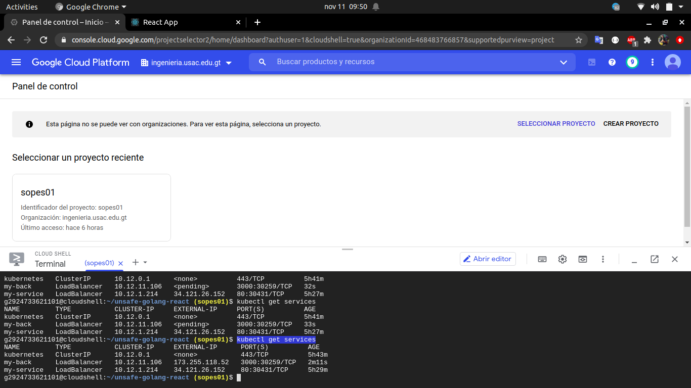
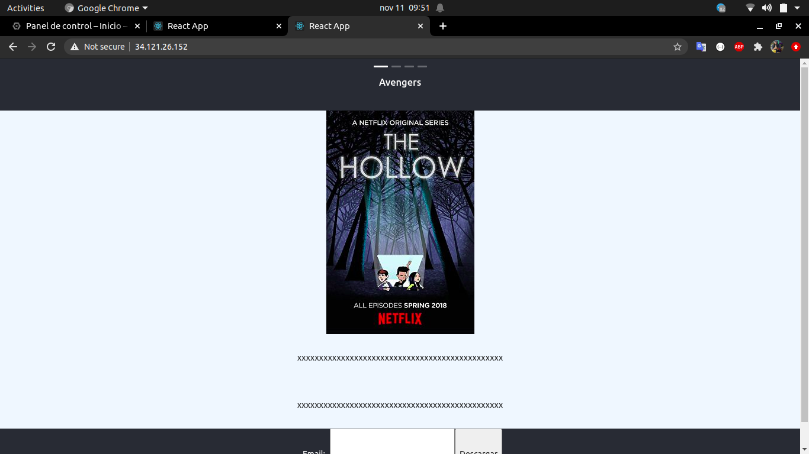

## Virtualización ligera

1. Se crea la imagen de docker

```
docker build -t imagen .
```


2. Se tagea la imagen

```
docker tag back:latest us.gcr.io/sopes01/back:latest
```


3. Se sube a un repositorio de imagenes de docker, este caso se uso el de google

```
docker push us.gcr.io/sopes01/back:latest
```


4. Se crea un archivo .yml con todas las configuraciones

```yaml
apiVersion: apps/v1
kind: Deployment 
metadata:
  labels:
    environment: test
  name: testdeploy 
spec:
  replicas: 3
  selector:
    matchLabels:
      environment: test
  minReadySeconds: 10
  strategy:
    rollingUpdate:
      maxSurge: 1
      maxUnavailable: 0
    type: RollingUpdate 
  template: 
     metadata:
       labels:
         environment: test
     spec:
       containers:
       - image: us.gcr.io/sopes01/image
         name: nginx 
         ports:
           - containerPort: 80

```

5. Se ejecuta el siguiente comando

```
kubectl apply -f nginx-deployment-withrolling.yaml
```


6. Se expone el servicio 

```
kubectl expose deployment testdeploy --type=LoadBalancer --name=my-service
```


7. Se busca la ip y el puerto, donde esta el servicio

```
kubectl get service
```





